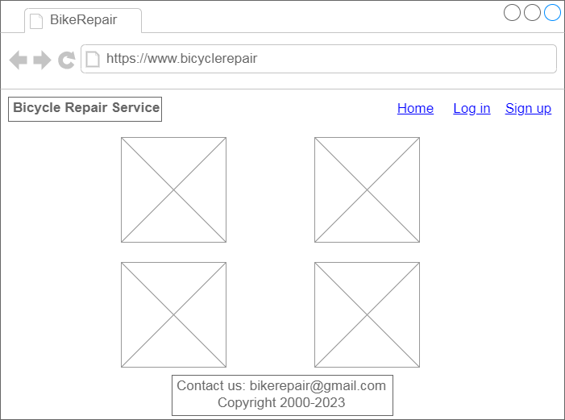
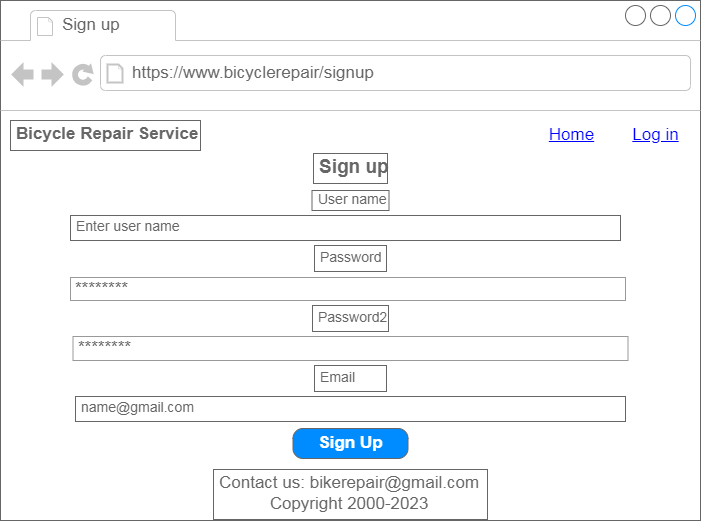
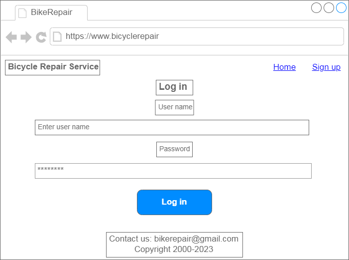
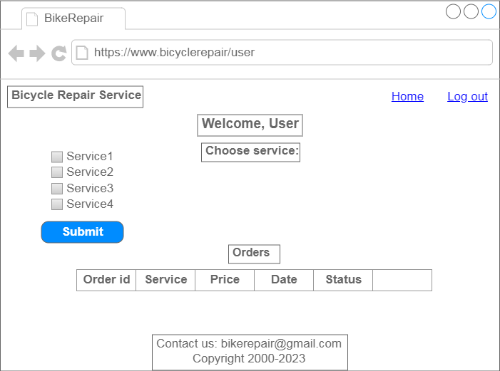
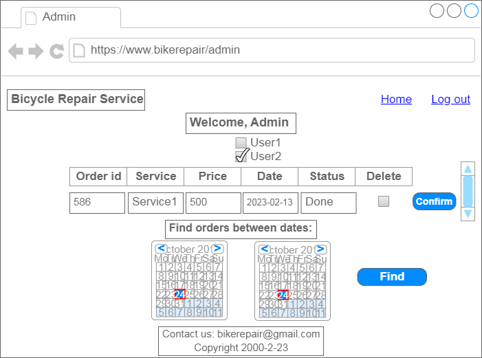

# About project
**"Bicycle Repair" web-application which allows bicycle enthusiasts to maintain, upgrade or repair their beloved bicycles by easy online record**

Application should provide:

- Storing client information, services and orders in database.
- Display list of services
- Client can choose service and make order.
- Sign up and login authentication for client or admin
- Display client's orders for user or admin
- Changing order status or delete order for admin
___
## Main page
Client can look at provided services

*Pic.1 Home page*

*main scenario:*

User chooses "Log in" or "Sign up"

## Authentication
  
User selects "Sign up" or "Log in".

*Pic.2 Sign up page*

*Pic.3 Log in page*

*main scenario:*

1. For "Log in" user fill  "login", "password" and click submit;
- if entered data is valid, then user is redirected to "User page";
- if entered data is not valid, error message occurs.
2. For "Sign up" user fills "login", "password", "email" and clicks submit;
- if entered data is valid, then user is redirected to "Log in" page;
- user is added to database;
- if entered data is not valid, error message occurs.

## User page

*Pic.4 User page*

*main scenario:*

1. User looks at list of services and chooses one or several options;
2. User clicks "Submit" and order will be added to the database;
3. User can see the list of his orders in the bottom.

## Admin page

*Pic.5 Admin page*

*main scenario:*

1. Admin can choose client which did an order; 
2. Admin can change order status option: "Pending", "In process" or "Done";
3. Admin can delete completed orders;
4. All changes commits by pushing "confirm".
5. Admin can find orders by the date, after that choose users and look at order information 